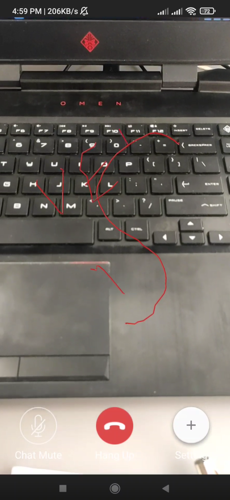

## Vebko AR Remote Assistance
Vebko AR Remote Assistance is an Android application that enables remote support through augmented reality and real-time video calling. The app integrates ARCore for AR-based calling, Vuforia for image playback, and uses WebRTC for communication. It also leverages Firebase for push notifications and uses a NodeJS-based signaling server to manage calls.

<a href="https://youtube.com/shorts/86Hc3CfxM2w">
  
</a>

## Features
- Profile Management:
    - Generates a unique identifier using Android’s secure ID or a random UUID.
    - Manages user profile data (first name, last name, phone number) and stores it locally via SharedPreferences.
    - Retrieves and updates user profile information from a remote server.

- Augmented Reality (AR) Calling:
    - Uses Google ARCore for AR video calling.
    - Checks for ARCore installation and prompts the user to install if necessary.

- Vuforia Image Playback:
    - Launches an image playback activity (using Vuforia) for augmented reality assistance.
    - Requests and handles camera permissions at runtime.

- Real-time Communication:
    - Initiates one-to-one calls using WebRTC.
    - Interacts with a NodeJS signaling server through websockets and RESTful APIs.

- Contact Management:
    - Maintains a list of contacts with unique identifiers.
    - Supports adding custom names to contacts and copying/sharing unique IDs.

- Connectivity Check:
    - Verifies network connectivity by pinging an external server (google.com).

## Dependencies
The project relies on several libraries and frameworks:
- AndroidX
  - AppCompat, RecyclerView, and other support libraries.
- Android Networking
  - Fast Android Networking for handling network calls.
Firebase
- Firebase 
  - Instance ID for obtaining the FCM token (for push notifications).
- Google ARCore
  - For augmented reality functionalities.
- Vuforia
  - For image playback augmented reality activities (via ImagePlayback activity).
- WebRTC Utility
  - Custom or third-party WebRTC library (e.g., dds-webrtclib) for video calling.
- SpinKit
  - Android SpinKit for loading indicators.

Ensure that these libraries are added in your ```build.gradle``` file and that you have the correct versions compatible with your project.

## Contributing
Contributions are welcome. If you find a bug or have a feature request, please open an issue or submit a pull request.

## Resources
- [webrtc VideoCall](https://github.com/ddssingsong/webrtc_android)
- [ARCore](https://developers.google.com/ar)
- [Vuforia Engine](https://developer.vuforia.com/home)
